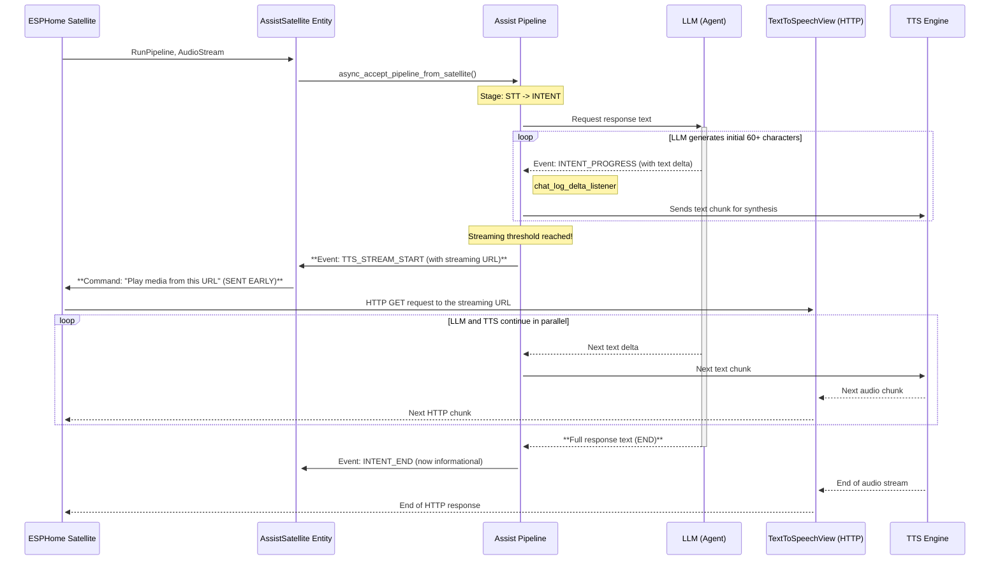
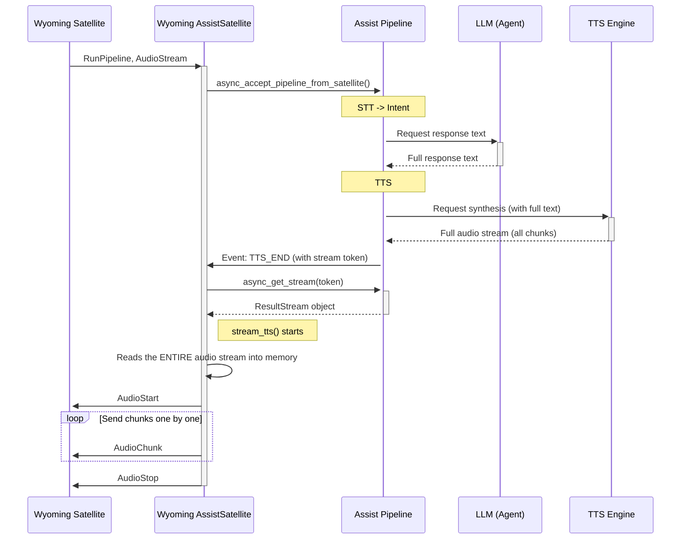

Current implementation, using tts with streaming support:

```mermaid
sequenceDiagram
    participant ESPHome Satellite
    participant AssistSatellite Entity
    participant Assist Pipeline
    participant LLM (Agent)
    participant TextToSpeechView (HTTP)
    participant TTS Engine

    ESPHome Satellite->>+AssistSatellite Entity: RunPipeline, AudioStream
    AssistSatellite Entity->>+Assist Pipeline: async_accept_pipeline_from_satellite()
    Note over Assist Pipeline: Stage: STT -> INTENT
    
    Assist Pipeline->>+LLM (Agent): Request response text
    
    %% Parallel processing starts
    loop LLM generates initial 60+ characters
        LLM (Agent)-->>Assist Pipeline: Event: INTENT_PROGRESS (with text delta)
        note right of Assist Pipeline: chat_log_delta_listener
        Assist Pipeline->>+TTS Engine: Sends text chunk for synthesis
    end

    %% "Optimistic Start" Trigger
    note over Assist Pipeline: Streaming threshold reached!
    Assist Pipeline->>+AssistSatellite Entity: **Event: TTS_STREAM_START (with streaming URL)**
    AssistSatellite Entity->>+ESPHome Satellite: **Command: "Play media from this URL" (SENT EARLY)**
    
    %% HTTP streaming starts while LLM is still working
    ESPHome Satellite->>+TextToSpeechView (HTTP): HTTP GET request to the streaming URL
    
    loop LLM and TTS continue in parallel
        LLM (Agent)-->>Assist Pipeline: Next text delta
        Assist Pipeline->>+TTS Engine: Next text chunk
        TTS Engine-->>TextToSpeechView (HTTP): Next audio chunk
        TextToSpeechView (HTTP)-->>ESPHome Satellite: Next HTTP chunk
    end

    LLM (Agent)-->>-Assist Pipeline: **Full response text (END)**
    Assist Pipeline->>AssistSatellite Entity: Event: INTENT_END (now informational)
    
    TTS Engine-->>TextToSpeechView (HTTP): End of audio stream
    TextToSpeechView (HTTP)-->>ESPHome Satellite: End of HTTP response
```
---
The old method:

```mermaid
sequenceDiagram
    participant Wyoming Satellite
    participant Wyoming AssistSatellite
    participant Assist Pipeline
    participant Agent as LLM (Agent)
    participant TTS Engine

    Wyoming Satellite->>+Wyoming AssistSatellite: RunPipeline, AudioStream
    Wyoming AssistSatellite->>+Assist Pipeline: async_accept_pipeline_from_satellite()
    Note over Assist Pipeline: STT -> Intent
    Assist Pipeline->>+Agent: Request response text
    Agent-->>-Assist Pipeline: Full response text
    Note over Assist Pipeline: TTS
    Assist Pipeline->>+TTS Engine: Request synthesis (with full text)
    TTS Engine-->>-Assist Pipeline: Full audio stream (all chunks)
    Assist Pipeline->>Wyoming AssistSatellite: Event: TTS_END (with stream token)

    Wyoming AssistSatellite->>+Assist Pipeline: async_get_stream(token)
    Assist Pipeline-->>-Wyoming AssistSatellite: ResultStream object
    
    note right of Wyoming AssistSatellite: stream_tts() starts
    Wyoming AssistSatellite->>Wyoming AssistSatellite: Reads the ENTIRE audio stream into memory
    
    Wyoming AssistSatellite->>+Wyoming Satellite: AudioStart
    loop Send chunks one by one
        Wyoming AssistSatellite->>Wyoming Satellite: AudioChunk
    end
    Wyoming AssistSatellite->>-Wyoming Satellite: AudioStop
```
