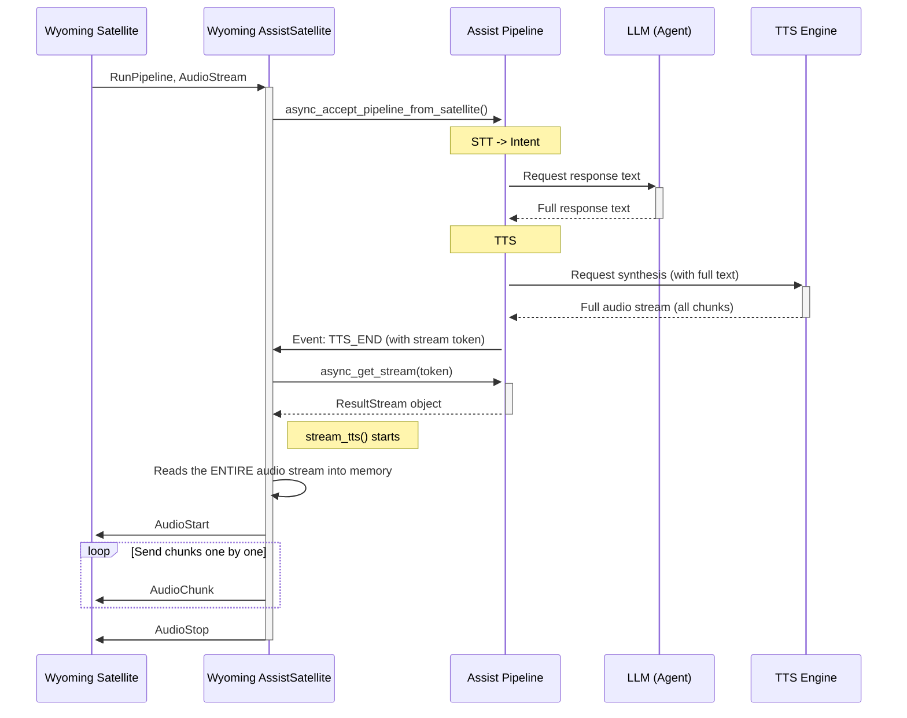

- This is a very rough draft. Configure via GUI, specify the host and port of the Wyoming server. Select voice.
- In general, it would be good to figure out if there’s a standard way of working with languages. The implementation varies across different integrations.

