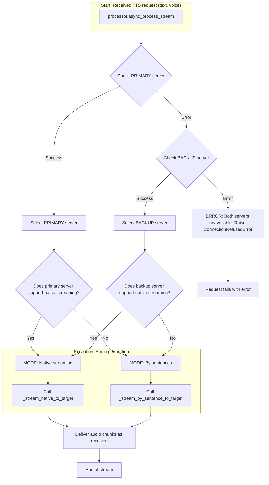

## Alternative Wyoming TTS Client with streaming synthesis method
 The voice component of HA is under active development, so the information in the description may be out of date.
- This is a rough draft. Configure via GUI, specify the host and port of the Wyoming server. Go to the entry configuration and select a voice to complete the setup.
- [HA 2025.07] Text in the `set_conversation_response` block (e.g., transmitted via a variable) and tts.speak service uses an legacy method (we obtain the full audio and send it to the client).
###### It is possible to manually tweak the system component code to improve the response time a bit. I wrote about it [here](https://github.com/home-assistant/core/issues/147727#issuecomment-3017257965). A similar thing can be done for the announcement action. But since the changes will disappear with every update, let's hope that the developers will independently improve this functionality in future updates.

- By the way, streaming response does not create a cache (long-term as a file, but temporary is still present, e.g. to be able to debug). To further reduce disk activity, I made a fix for Piper that disables the intermediate stage of creating a wav file; instead, it immediately returns a stream of raw data. Thus, all actions within a voice request are processed in memory. Do not use this fix for the Wyoming system integration, as it performs poorly with the stream and adds extra latency.

#### A few [diagrams](https://github.com/mitrokun/streaming_tts_proxy/blob/main/DIAGRAM.md)

---
### Fallback support

* Added support for a fallback TTS server to to ensure improve reliability  during primary server outages.
* Optimized integration loading during Home Assistant restart: integrations will continue to function even if the main server is unavailable. Voice lists will be automatically restored when the main server reappears on the network and a request is made; until then, a fallback server will be utilized. Do not configure the entry when the main server is disabled.
* In addition to local providers, cloud providers can be used through appropriate integrations, e.g. [wyoming_openai](https://github.com/roryeckel/wyoming_openai).

To set up a fallback server, you will need to know the voice's name. You can find the names of the voices by going to the `Media` tab -> `tts`  and selecting your engine.

Example for PiperTTS configuration on the `192.168.1.199` host:

