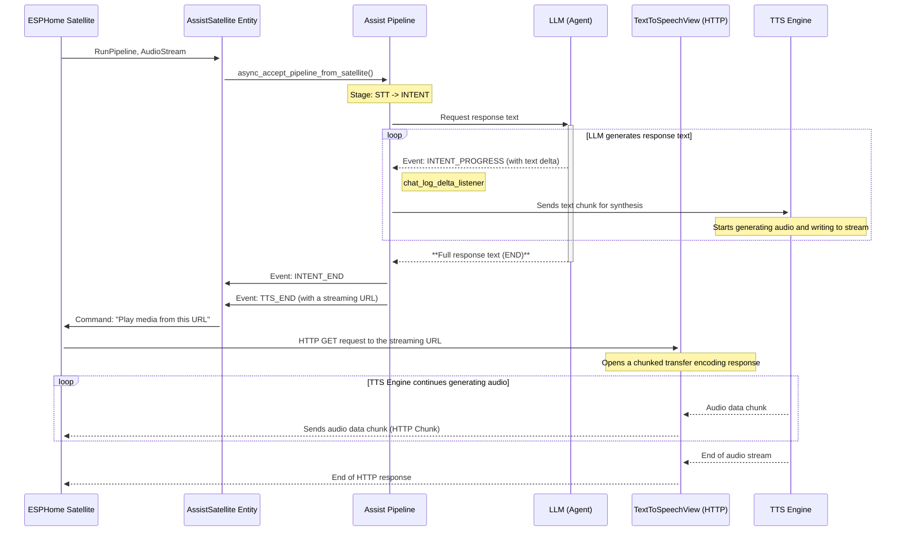
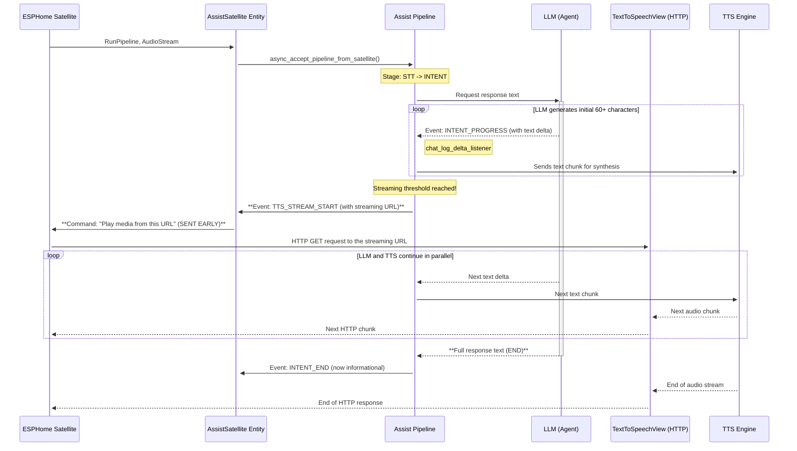
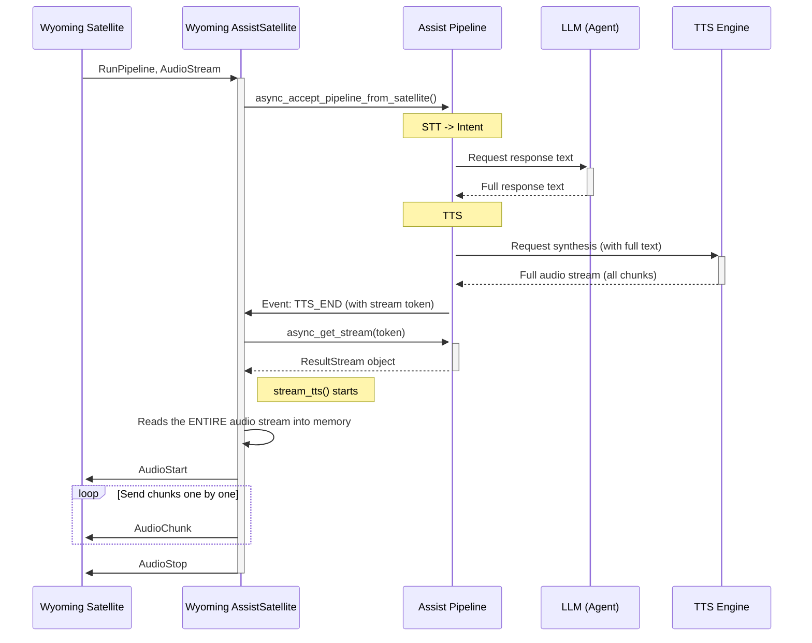

- This is a very rough draft. Configure via GUI, specify the host and port of the Wyoming server. Select voice.
- In general, it would be good to figure out if there’s a standard way of working with languages. The implementation varies across different integrations.
- Long text in the `set_conversation_response` block (e.g., transmitted via a variable) will still cause problems for slow TTS. Although the text is processed in separate parts and could start playing, the finished file for the satellite will only be provided after complete generation.

## A few diagrams
Current implementation for esp32 satellites, using tts with streaming support:

---
Final expected implementation for esp32 satellites. Modifications are required for HA components (assist_pipeline and assist_satellite). 

Calling Assist via the UI already works in a similar way:

---
The old method, still used for Wyoming satellite:

